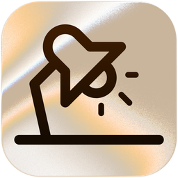

<p align="center">
  
</p>

<h1 align="center">Worktable</h1>

<p align="center">
  <strong>A quiet home for everything worth keeping.</strong>
</p>

<p align="center">
  Native macOS notes, quick captures, and an assistant that can search your knowledge.
</p>

<p align="center">
  
  
  <a href="LICENSE"></a>
</p>

<p align="center">
  <a href="#features">Features</a> ·
  <a href="#get-started">Get started</a> ·
  <a href="#keyboard-shortcuts">Shortcuts</a> ·
  <a href="#development">Development</a> ·
  <a href="#license">License</a>
</p>

---

Good ideas rarely arrive in the right window. Worktable gives you somewhere to
put them: a snippet from another app, a link to revisit, an image, or a thought
you do not want to lose. Keep them in a local library, connect them into
knowledge, and ask questions when you need the context back.

**Capture → Collect → Connect**

1. **Capture the moment.** Type a note, add an image, or press Shift three times
   quickly to capture a selection from another app.
2. **Keep the context.** Search your entries, browse by topic, and bring your
   GitHub stars into the same library.
3. **Find the connection.** Build knowledge, then ask the assistant about what
   you have saved. Citation chips take you back to the original entries.

## Features

| | What you can do |
| --- | --- |
| **Quick capture** | Save selected text or images with triple-Shift, without switching away from the app you are using |
| **A library for more than text** | Keep notes, links, and images together; open full entries and view images fullscreen |
| **Search and organize** | Filter entries and sort by time, alphabetically, or by topic; use keyboard navigation and multi-selection |
| **Connected knowledge** | Build local topics and relationships, with optional AI topic enrichment from your chosen provider |
| **An assistant with context** | Read streaming answers, follow source citations, stop a running answer, and reopen saved chats |
| **GitHub stars** | Import repositories you have starred, including their descriptions and links |
| **At home on macOS** | Stay in the menu bar, use native menus and shortcuts, and switch between Ayu Light and Ayu Dark |

Built with **Rust, GPUI, and GPUI Component**. The AI runtime lives in the native
app through Rig; there is no JavaScript worker or separate sidecar to install.

## Get started

### Run from source

You will need:

- **macOS** — the packaged app targets macOS 13 or later.
- **Rust installed through [rustup](https://rustup.rs/)** — the repository pins
  its nightly toolchain in [`rust-toolchain.toml`](rust-toolchain.toml).
- **Xcode Command Line Tools** — install them with `xcode-select --install` if
  they are not already available.

```sh
git clone https://github.com/MalinrRuwan/worktable.git
cd worktable
cargo run -p worktable-app
```

Rustup selects the pinned toolchain automatically. The first build takes longer
while it compiles the native UI dependencies.

### Make it yours

1. **Take the welcome tour.** Every step is skippable, and you can replay it
   from Settings → Appearance.
2. **Enable capture when you want it.** The tour links to macOS Accessibility
   settings. Triple-Shift uses the foreground app's Copy action and clipboard,
   so that app must support copying the selected text or image.
3. **Add your first note.** The note bar is always ready: type and press Return.
   Use its plus button to choose an image.
4. **Set up the assistant, optionally.** Open Settings → Providers, configure a
   provider, and choose a model. Build knowledge before asking about your library.

Notes and the local knowledge-building pass work without an AI provider.
Closing the window keeps Worktable in the menu bar by default; change **Keep
running in the menu bar** in Settings → General if you prefer closing to quit.

### Choose your AI provider

| Provider | Authentication |
| --- | --- |
| OpenCode, with Go and Zen services | API key |
| OpenAI | API key |
| ChatGPT subscription | Device OAuth sign-in |
| Anthropic | API key |
| DeepSeek | API key |

Available models come from authenticated provider discovery, not a bundled
model list. ChatGPT subscription sign-in is separate from an OpenAI API key.
Provider access, limits, and any charges depend on the service you choose.

## Keyboard shortcuts

| Shortcut | Action |
| --- | --- |
| ⇧ three times quickly | Capture selected text or an image from another app |
| ⌘F | Return to Entries and focus search |
| ⌘1 / ⌘2 | Show Entries / Assistant |
| ⌘, | Open Settings |
| ⌘T | Switch between light and dark themes |
| ↑ / ↓ | Move the entry selection |
| Return | Open the selected entry |
| Delete (⌫) | Delete selected entries |
| ⌘C / ⌘⇧C | Copy selected entries / copy the selected entry's link |
| ⌘⇧P | Clear search |
| ⌘Return | Submit the note bar |
| Escape (⎋) | Dismiss the current overlay or image viewer |
| ⌘Q | Quit Worktable |

Entry commands are scoped to the Entries page and yield to focused text
fields. Return in the note bar adds a note; Return in search sends the query
to the assistant instead of opening an entry.

## Your data

Worktable stores its library locally. By default:

| Location | Contents |
| --- | --- |
| `~/.worktable/worktable.db` | Entries, settings, provider credentials, saved chats, and model context |
| `~/.worktable/media/` | Imported images, hard-linked when possible and copied across devices |
| `~/.worktable/images/` | Images saved by global capture |

**Local storage does not mean local AI inference.** Assistant prompts, retrieved
entry content, and content used for AI topic enrichment can be sent to your
configured provider. GitHub imports contact GitHub, and loading remote images
contacts their hosts.

Provider credentials are stored in Worktable's database, not the macOS
Keychain. Treat the database and its backups as sensitive, and never commit
credentials to the repository.

## Under the hood

One native app, with a small Rust workspace:

| Crate | Responsibility |
| --- | --- |
| [`worktable-app`](crates/worktable-app/) | macOS shell, main view, settings, capture, and service orchestration |
| [`worktable-ui`](crates/worktable-ui/) | Shared motion, activity indicators, streaming text, and interactive citations |
| [`worktable-ai`](crates/worktable-ai/) | Rig-backed assistant, providers, model discovery, and cancellation |
| [`worktable-db`](crates/worktable-db/) | SQLite persistence for the native app |
| [`worktable-events`](crates/worktable-events/) | Typed events shared across the app and runtime |
| [`worktable-helix`](crates/worktable-helix/) | Embedded knowledge graph, topic extraction, and search |

## Development

The everyday development loop is:

```sh
cargo run -p worktable-app
```

Workspace crates retain debug information, while dependencies are optimized
so the debug UI stays responsive.

### Checks

```sh
cargo test -p worktable-ui
cargo test -p worktable-app
cargo test --workspace
cargo clippy --workspace --all-targets -- -D warnings
cargo fmt --all -- --check
```

UI interaction tests exercise the real view using stable debug selectors.
Provider tests do not make live AI requests.

<details>
<summary>Real Metal visual snapshots</summary>

The macOS visual runner is a binary so it can render on the main thread:

```sh
cargo run -p worktable-app --bin worktable_visual_test --features visual-tests
```

To intentionally update its baselines:

```sh
UPDATE_BASELINE=1 cargo run -p worktable-app --bin worktable_visual_test --features visual-tests
```

Visual snapshots complement interaction tests; they do not replace them.

</details>

### Development overrides

| Variable | Purpose |
| --- | --- |
| `WORKTABLE_DB_PATH` | Use a different database file |
| `WORKTABLE_THEMES_DIR` | Watch a different directory for development theme overrides |
| `RUST_LOG` | Configure logging, for example `worktable=debug` |

### Package a macOS app

Set the version you want to package:

```sh
VERSION=1.3.0 sh scripts/package-macos.sh
```

The script builds the release binary, bundles themes and the app icon, signs
the app, and creates:

```text
dist/
├── Worktable.app
├── Worktable-1.3.0.dmg
└── Worktable-1.3.0.dmg.sha256
```

Packaging uses the host architecture and ad-hoc signing by default; it does
not notarize the app. Generated files in `dist/` are ignored by Git.

### Contributing

Bug reports and focused improvements are welcome. Read [`AGENTS.md`](AGENTS.md)
for the project's architecture, UI, accessibility, and testing conventions
before changing code. Include tests for behavior changes and run the checks
above before submitting a pull request.

## Acknowledgments

Worktable builds on [GPUI](https://www.gpui.rs/) from Zed,
[GPUI Component](https://github.com/longbridge/gpui-component) from Longbridge,
and [Rig](https://rig.rs/). Its agent presentation includes components adapted
from [aiCSS](https://www.aicss.dev), with motion inspired by
[transitions.dev](https://transitions.dev/) and the
[Ayu](https://github.com/ayu-theme) theme family.

## License

Worktable is licensed under the [MIT License](LICENSE).

Copyright © 2026 Malin Dhamsara. Dependencies and adapted components retain
their respective licenses.
